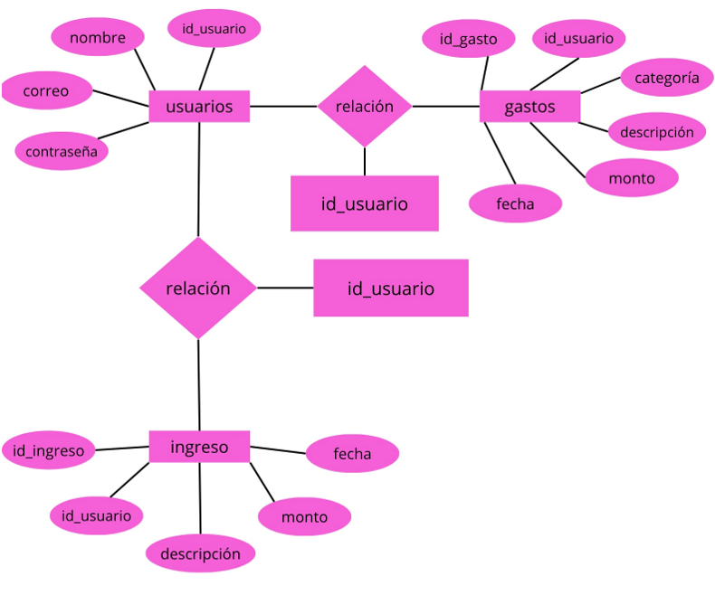

# SmartFinance

# Objetivo de una Aplicación Web

Nuestro objetivo con esta aplicación es ayudar a los usuarios a llevar un mejor control de sus finanzas personales mediante el registro y administración de ingresos y gastos. Además, se busca mejorar progresivamente el sistema agregando nuevas funciones y optimizando su funcionamiento en futuras actualizaciones.

1. **Control financiero:** Permitir a los usuarios registrar y organizar sus gastos e ingresos fácilmente.
2. **Accesibilidad:** Facilitar el acceso desde cualquier lugar con conexión a Internet.
3. **Experiencia de usuario:** Brindar una interfaz sencilla, intuitiva y fácil de usar.
4. **Organización:** Ayudar a identificar en qué categorías se gasta más dinero.
5. **Actualizaciones continuas:** Mejorar constantemente el sistema incorporando nuevas funciones y mejoras.

# 📄 Datos Generales

## Integrantes

### Integrante 1
- **Nombre completo:** Carvajal Bustillos Gael Alan  
- **Edad:** 17  
- **Correo electrónico:** 23308060610312@cetis61.edu.mx  
- **Especialidad:** Programación  
- **Institución:** CETis 61  

### Integrante 2
- **Nombre completo:** Ramirez Vela Areli
- **Edad:** 17  
- **Correo electrónico:** 23308060610066@cetis61.edu.mx  
- **Especialidad:** Programación  
- **Institución:** CETis 61  

# 📘 Descripción del Proyecto

SmartFinance es una aplicación web desarrollada para ayudar a los usuarios a registrar, organizar y controlar sus ingresos y gastos personales de manera sencilla y eficiente.

El sistema permite crear una cuenta e iniciar sesión para que cada usuario pueda administrar únicamente su propia información financiera.

La aplicación incluye funciones para:
- Agregar gastos e ingresos
- Editar registros
- Eliminar información
- Consultar movimientos financieros
- Filtrar gastos por categorías y fechas
- Calcular automáticamente totales de ingresos y gastos

La finalidad principal del proyecto es apoyar a las personas en la administración de su dinero, promoviendo una mejor organización financiera mediante una plataforma digital práctica y accesible.

# 🗂️ Diagrama Entidad-Relación

# 💾 Base de Datos

La base de datos utilizada se llama `smartfinance` y fue desarrollada en MariaDB utilizando HeidiSQL.

El sistema cuenta con tres tablas principales:
- usuarios
- gastos
- ingresos

Se utilizaron:
- Llaves primarias (PRIMARY KEY)
- Llaves foráneas (FOREIGN KEY)

Esto permite mantener la integridad de la información y la relación correcta entre los datos almacenados.
